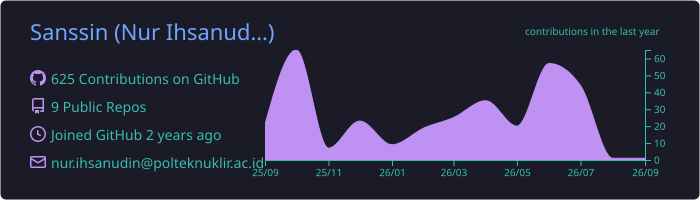
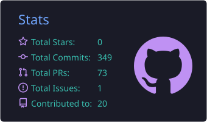
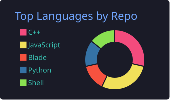

<!-- Header / Typing effect -->
<div align="center">
  
</div>

<br/>

<!-- Bio -->
```bash
sanssin@ubuntu:~$ whoami
Nur Ihsanudin

sanssin@ubuntu:~$ cat bio.txt
Started in nuclear instrumentation by accident.

Never left, because the alternative was explaining career changes to my mom.

Now building web platforms for nuclear science and ML models that occasionally work.
```

<!-- Skills -->
```bash
sanssin@ubuntu:~$ ls -l ./skills
```

<p align="left">
  <strong>💻 Frontend & Scripting:</strong><br/>
  <br/>
  &nbsp;
  &nbsp;
  &nbsp;
  &nbsp;
  &nbsp;
  &nbsp;
  &nbsp;
  &nbsp;
  
</p>

<p align="left">
  <strong>⚙️ Tools & Infrastructure:</strong><br/>
  <br/>
  &nbsp;
  &nbsp;
  &nbsp;
  &nbsp;
  
</p>

<br/>

<!-- Projects -->
```bash
sanssin@ubuntu:~$ ./show_featured_projects.sh --top 4
Loading repositories...
```

| | |
| :---: | :---: |
| <br/><a href="https://github.com/Sanssin/Inite"></a><br/><br/>Indonesian Nuclear Interactive Website.<br/><br/>`React` `JavaScript` `Python` `HTML5`<br/><br/> | <br/><a href="https://github.com/Sanssin/pkm-simulator-PLTN"></a><br/><br/>Firmware for PWR nuclear reactor simulation using Raspberry Pi.<br/><br/>`Python` `Raspberry Pi` `Touchscreen`<br/><br/> |
| <br/><a href="https://github.com/Sanssin/Smart-Irrigation-System-based-Time-using-Arduino-and-RTC"></a><br/><br/>Automated plant watering system based on Arduino and RTC.<br/><br/>`Arduino` `C++` `RTC`<br/><br/> | <br/><a href="https://github.com/Sanssin/esp32-oscilloscope"></a><br/><br/>Digital oscilloscope project utilizing ESP32 microcontroller.<br/><br/>`ESP32` `C++`<br/><br/> |

<br/>

<!-- Stats -->
```bash
sanssin@ubuntu:~$ htop --user sanssin --view github_stats
```

<div align="center">
  
</div>
<br/>
<div align="center">
  
  
</div>

<br/>

<!-- Contact -->
```bash
sanssin@ubuntu:~$ ./connect_to_network.sh
Connecting to external relays... [OK]
```

<div align="center">
  <a href="https://www.linkedin.com/in/nur-ihsanudin" target="_blank">
    
  </a>
  <a href="https://www.instagram.com/lhsxn_n" target="_blank">
    
  </a>
  <a href="mailto:nur.ihsanudin@polteknuklir.ac.id" target="_blank">
    
  </a>
</div>

<br/>

<p align="center">
  
</p>
